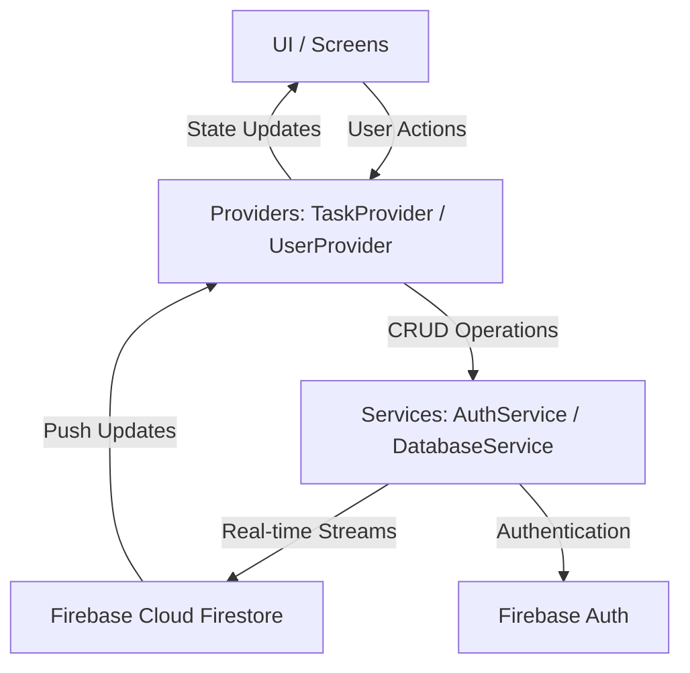

<div align="center">
  
  
  # 🚀 Tracking Task
  **A Premium Task Management & Analytics Platform built with Flutter & Firebase**

  <p align="center">
    
    
    
    
  </p>
</div>

---

## 📖 Overview

**Tracking Task** is a modern, high-performance task management application architected for individuals and agile teams to seamlessly organize, assign, and track daily tasks. Built from the ground up with a **premium dark-mode UI**, the application delivers an unparalleled user experience with elegant design elements, micro-animations, and fluid navigation.

Beyond standard task management, the app provides robust **Role-Based Access Control (RBAC)** and deep data visualization using `fl_chart`, eliminating the need for external analytics tools and keeping all productivity metrics on-device and real-time.

---

## 🏗️ Architecture & Data Flow

The application follows a clean, decoupled architecture leveraging `Provider` for state management and dependency injection.



---

## ✨ Key Features

### 🔐 Enterprise Security & Roles
- **Firebase Authentication:** Secure, scalable email/password login and registration.
- **Role-Based Access Control (RBAC):**
  - **Admins:** Have global privileges to create tasks, assign work to specific interns/students, and monitor overall team velocity.
  - **Interns/Students:** Access personalized, distraction-free dashboards displaying only their assigned tasks.

### ⚡ Real-Time Cloud Synchronization
- **Firestore Integration:** Tasks and statuses are synchronized instantly across all devices.
- **Optimistic UI Updates:** Smooth transitions and instant feedback, even on poor network conditions.

### 📊 Dynamic Productivity Analytics (`fl_chart`)
- **Interactive Data Visualization:** Instead of static views, the app leverages the powerful `fl_chart` library to render beautiful, interactive pie charts and bar graphs.
- **Metrics Breakdown:** Real-time visual breakdown of Total, Pending, Active, and Completed tasks.
- **No External Uploads Required:** All analytics are computed securely and rendered natively on the device, meaning you never have to upload data to third-party tracking tools.

### 🎨 State-of-the-Art UI/UX
- **Premium Dark Theme:** A carefully curated dark color palette designed to reduce eye strain while looking modern.
- **Glassmorphism & Animations:** Subtle blurs, staggered list loading, and smooth routing animations create a living, breathing interface.

---

## 🛠️ Technology Stack

| Layer | Technology / Package | Purpose |
| :--- | :--- | :--- |
| **Frontend Framework** | **Flutter** (Dart) | Cross-platform UI development |
| **State Management** | `provider` | Reactive state injection and UI updates |
| **Database** | `cloud_firestore` | Real-time NoSQL cloud database |
| **Authentication** | `firebase_auth` | Secure identity management |
| **Data Visualization** | `fl_chart` | Interactive charts and analytics rendering |
| **Design System** | Custom `app_theme.dart`| Global dark mode tokens and typography |

---

## 📂 Project Structure

```text
lib/
├── models/         # Data classes (Task, User)
├── providers/      # State management (TaskProvider, UserProvider)
├── repositories/   # Firebase abstraction and streaming logic
├── screens/        # UI Views (Home, Profile, Analytics Dashboard)
├── services/       # Core backend integrations (Auth, DB)
├── widgets/        # Reusable UI (TaskCards, fl_chart wrappers, Modals)
├── theme/          # Design system & color tokens
└── main.dart       # App bootstrapper
```

---

## 🚀 Setup & Installation

### Prerequisites
- [Flutter SDK](https://docs.flutter.dev/get-started/install) (v3.19.0+)
- Active [Firebase Project](https://console.firebase.google.com/)

### Configuration Steps

1. **Clone the repository**
   ```bash
   git clone https://github.com/withshafan/task_tracking_app.git
   cd task_tracking_app
   ```

2. **Install Dependencies**
   ```bash
   flutter pub get
   ```

3. **Connect Firebase**
   - Register your Android/iOS apps in the Firebase Console.
   - Download `google-services.json` (Android) and `GoogleService-Info.plist` (iOS) and place them in their respective native directories.
   - Enable **Email/Password** Auth and **Firestore**.

4. **Run the App**
   ```bash
   flutter run
   ```

---

<div align="center">
  <b>Built with ❤️ by withshafan</b><br>
  Tracking Task © 2026
</div>
